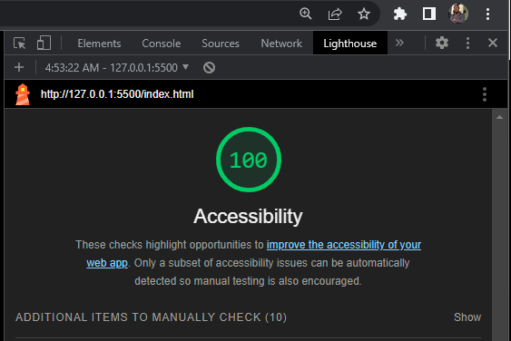

# 201-code-project
Code 201 Project for Code X Academy

## Lighthouse report from Chrome Dev Tools

### Links and Resources

[Set Universal Root Colors](https://www.youtube.com/watch?v=3X28IUF4HAQ)

[CSS Color Cariables and Properties in Theming](https://joshuatz.com/posts/2021/common-css-color-variables-properties-theming/)